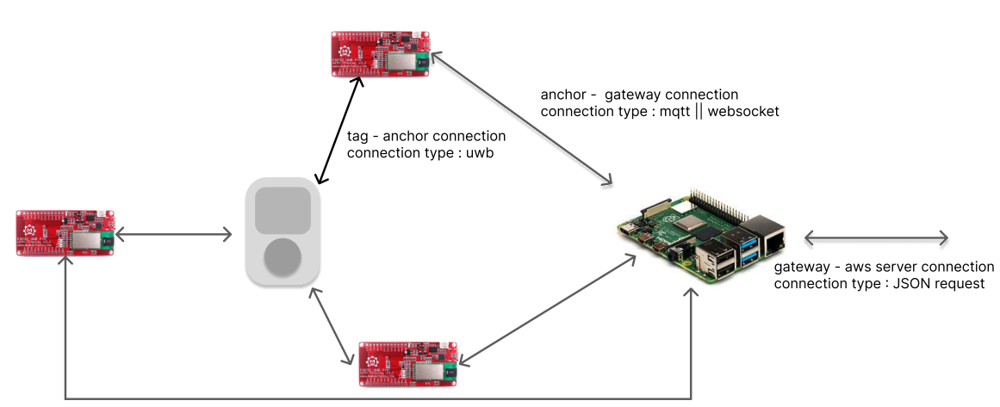

# IPS(Indoor Positioning System) 핵심 기술

여정 프로젝트의 IoT 시스템 문서입니다. UWB(ultra wideband) 초광대역 통신모듈을 활용하여 미술관 내의 정밀 위치를 서버에 송신하는 역할을 담당합니다.

IoT 부문은 크게 3가지로 구분이 됩니다.

| 구분 | 설명 |
| --- | --- |
| 사용자 Tag | 사용자가 보유하고 있는 미술품을 등록하는 beacon 형 IoT 기기 |
| 거리측정용 Anchor | 사용자의 Tag로부터 거리를 측정하는 beacon |
| Gateway | Anchor에서의 거리정보로부터 맵내 x, y 좌표를 추출하여 서버에 송신 |

| 구분 | 상세 기능 |
| --- | --- |
| 사용자 Tag | RFID 태깅을 통한 기기 등록 및 인식 16*2 LCD 화면을 통한 상태 출력 UWB 모듈을 ToF(Time of Flight) 기반 통신 거리 측정 button을 탑재하여 이벤트 입력 |
| 거리 측정 Anchor | MQTT 기반으로 gateway와 통신 UWB 모듈을 ToF(Time of Flight) 기반 통신 거리 측정 |
| Gateway | Anchor로부터 받은 distance, Tag 입력 상태, tagID 종합하여 server에 송신  |

### System Diagram

UWB based indoor positioning system

KIOSK

## 기술스택 및 라이브러리

### Operating System

| Project | Version | Description |
| --- | --- | --- |
| RaspberryPi OS | 1.7.5 | gateway or kiosk(todo) |
| Arduino-IDE | 2.1.1 | 사용자 tag base board |

### Libraries

| Project | Version | Description |
| --- | --- | --- |
| DW1000 | 0.9.0 | Library for UWB sensor control  |
| MFRC522 | 1.4.10 | RFID Library |
| mosquitto | 2.0.15 | Anchor - 중계기 간 MQTT 통신 |
| jsoncpp | 1.y.z | 중계기 - 서버 간 통신 |

## 개발 환경 구성(기기 셋업)

### RaspberryPi ( KIOSK )

여기에 RaspberryPi OS 설치 방법 설명 TODO

### Arduino ( UserIoT )

여기에 Arduino-IDE 설치 방법 설명 TODO

ESP32 / DW1000 / MQTT(혹은 소켓)

### 연산 프로그램(C/C++ Base)

MQTT libraray(혹은 소켓) / RestAPI TODO

# 기반 기술

초 광대역(Ultra-Wideband, UWB) 통신은 넓은 주파수 대역을 이용하여 단거리에서 높은 속도로 데이터를 전송하는 무선 통신 기술입니다. 전통적인 좁은 대역 통신 시스템과 달리 UWB는 신호를 GHz 단위로 이루어진 넓은 주파수 대역에 퍼뜨려 전송합니다.

UWB는 다른 무선 통신 기술에 비해 여러 가지 이점을 제공합니다:

1. 고속 데이터 전송: UWB는 아주 높은 데이터 전송 속도를 달성할 수 있으며, 종종 기가비트 단위로 이루어집니다. 이는 멀티미디어 스트리밍이나 고속 파일 전송과 같이 빠르고 효율적인 데이터 전송이 필요한 응용 분야에 적합합니다.
2. 저전력 소비: UWB 장치는 일반적으로 낮은 전력 수준에서 동작하므로, 에너지 효율적이고 스마트폰, 태블릿, 웨어러블 장치와 같은 배터리로 작동하는 장치에 적합합니다.
3. 단거리 통신: UWB는 주로 몇 미터 또는 몇 십 미터 이내의 짧은 거리 통신을 위해 설계되었습니다. 무선 개인 영역 네트워크(WPAN), 무선 센서 네트워크(WSN), 근거리 응용 프로그램과 같은 응용 분야에 적합합니다.
4. 강건성 및 간섭 저항성: UWB 신호는 아주 낮은 전력 수준을 사용하고 넓은 주파수 대역을 차지하기 때문에 다른 무선 기술로부터 간섭을 견딜 수 있습니다. 이는 UWB 장치가 다른 무선 기술과 함께 간섭 문제 없이 공존할 수 있도록 해줍니다.

## TOF(Time of Flight)

신호의 송수신 간의 시간을 측정하여 distance(= T*C)를 구합니다. 

사용할 기법은 double-sided two way 기법으로 TOF를 Tag - Anchor, Anchor - Tag으로 2번 측정하여 더 높은 정확성의 변위를 구하는 방법입니다.

해당 변수들을 통해 시간을 구하는 수식은 다음과 같습니다.

다만, TDoA(Time Difference on Arrival) 방식과 비교할 필요가 있습니다.

기술적으로 TDOA는 내부 clock 간의 동기화가 관건이며 추후 성능 비교를 통해 변위 추정 방식을 선정할 예정입니다.

| 구분 | ToF | TDoA |
| --- | --- | --- |
| Power Consumption | High | Low |
| Tag capacity | Less | More |
| Synchronization Requirements | Low | High |
| Out-of-area positioning | Supported | Not Supported |